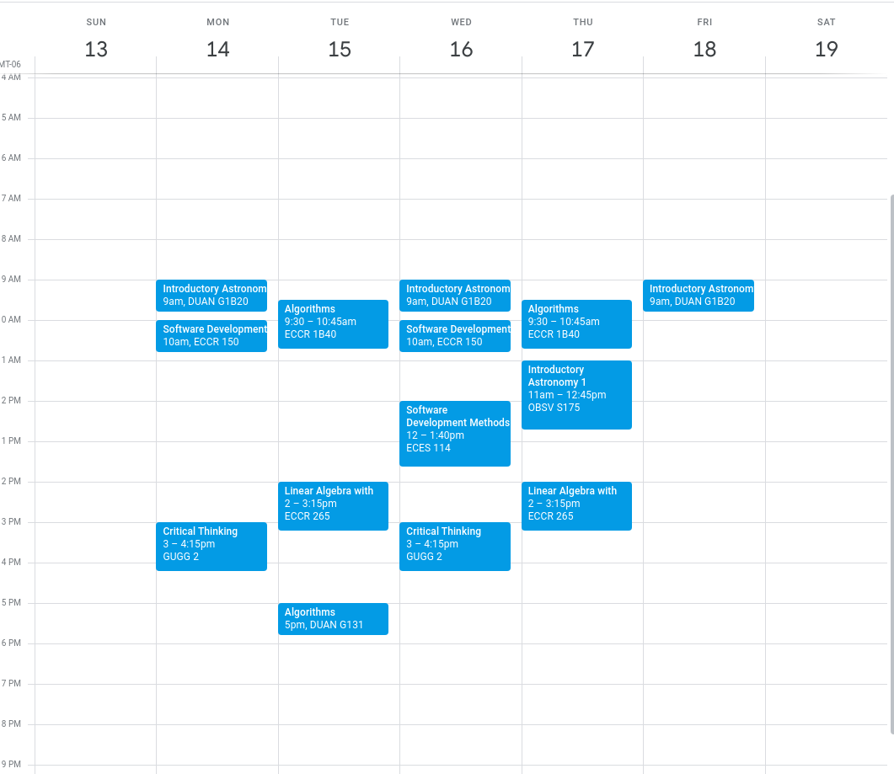

# cu-cli

[](https://www.npmjs.com/package/cu-cli)
[](https://travis-ci.com/kpfromer/cu-cli)
[](https://coveralls.io/github/kpfromer/cu-cli?branch=master)

A command line tool for Unversity of Colorado students to quickly get their GPAs, course details and sync their classes with their Google calendars.

## Install

```bash
npm i -g cu-cli
```

or

```bash
yarn global add cu-cli
```

## Usage

Firstly you will need to login to your cu account. The details of your account
are encrypted on the machine and stored using the system's keyring.

```bash
cu-cli login-cu
```

You can clear your CU login details by running the following command.

```bash
cu-cli clean
```

Then you can easily get your cu or course list.

```bash
cu-cli gpa
```

Returns:

```
3.8 (95%)
```

```bash
cu-cli courses
```

Returns:

```
Computer Systems (CSCI 2400-100) 4 credits  MWF 15:0-15:50
	Person Name - person.name@email.edu
Computer Systems (CSCI 2400-102) 0 credits  M 18:0-18:50
	Person Name - person.name@email.edu
Discrete Structures (CSCI 2824-001) 3 credits  MWF 9:0-9:50
	Person Name - person.name@email.edu
Calculus 2 (MATH 2300-015) 5 credits  M-F 14:0-14:50
	Person Name - person.name@email.edu
    Person Name - person.name@email.edu
General Physics 2 (PHYS 1120-100) 4 credits  MWF 10:0-10:50
	Person Name - person.name@email.edu
General Physics 2 (PHYS 1120-430) 0 credits  T 15:0-15:50
	Person Name - person.name@email.edu
Experimental Physics 1 (PHYS 1140-300) 1 credits  W 16:0-16:50
	Person Name - person.name@email.edu
Experimental Physics 1 (PHYS 1140-302) 0 credits  T 8:0-9:50
	Person Name - person.name@email.edu
```

### Syncing Courses with Google Calendar

You can easily sync your course list with Google Calendar. First you need to authenticate.

```
cu-cli login-google
```

Again you can clear your CU and Google login details by running the following command.

```bash
cu-cli clean
```

Then run the following command to sync your events with your calendar!

```bash
cu-cli sync
```

From zero to hero:


